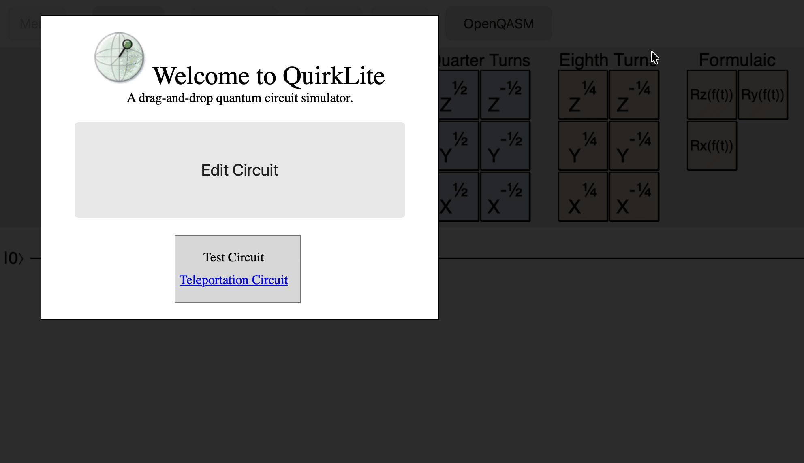

# QuirkLite



QuirkLite is a lightweight, browser-based quantum circuit simulator derived from the Quirk project. It is designed for experimenting with small quantum circuits through an interactive drag-and-drop interface, without requiring a separate desktop application.

## What QuirkLite does

QuirkLite lets you build and inspect quantum circuits directly in a web browser. Gates can be placed on circuit wires and the simulator updates the displayed quantum state as the circuit changes.

### Key features

- **Drag-and-drop circuit editing** — place gates onto circuit wires and rearrange them interactively.
- **Real-time simulation** — circuit results and state displays update as the circuit is edited.
- **Quantum state visualization** — inspect amplitudes, probabilities, densities, samples, Bloch-sphere information, and other intermediate states using display gates.
- **Circuit history** — undo and redo circuit changes.
- **Bookmarkable circuits** — circuit state can be preserved in the browser URL and revisited later.
- **Up to 16 qubits** — intended for small circuits that can be simulated interactively in a browser.
- **Built-in examples** — includes examples such as Grover search, Shor period finding, Bell/CHSH testing, quantum teleportation, and other demonstrations.
- **Standalone HTML output** — the build process produces a self-contained `out/quirk.html` file that can be opened directly in a browser.

## QuirkLite changes

QuirkLite is a customized version of Quirk with a simplified interface.

In particular, the **Make Gate** control and the **Version 2.3** label have been removed from the main interface. The application is intended to provide the core circuit-building and simulation experience without exposing the custom-gate creation control in the toolbar.

## Getting started

### Use the prebuilt application

If a built version of QuirkLite is available, open:

```text
out/quirk.html
```

in a modern web browser.

Because the application is packaged into a single HTML file, no web server is required for the basic offline build.

### Run from the source tree

Requirements:

- Git
- Node.js
- npm
- A modern browser with JavaScript and WebGL support

Install the development dependencies:

```bash
npm install
```

Build the application:

```bash
npm run build
```

The generated application will be written to:

```text
out/quirk.html
```

Open that file in a browser to run QuirkLite.

## Development commands

The project uses Grunt for building and Karma for browser-based tests.

### Build

```bash
npm run build
```

Builds the production-style application and generates `out/quirk.html`.

### Run tests

```bash
npm test
```

### Run tests in Chrome

```bash
npm run test-chrome
```

### Run tests in Firefox

```bash
npm run test-firefox
```

### CI-style test run

```bash
npm run test-travis
```

## Basic usage

| Action | How |
|---|---|
| Add a gate | Drag a gate from the toolbox onto the circuit |
| Move a gate | Drag the gate to another circuit position |
| Remove a gate | Drag it out of the circuit or use middle-click |
| Undo | `Ctrl+Z` or the **Undo** button |
| Redo | `Ctrl+Shift+Z`, `Ctrl+Y`, or the **Redo** button |
| Save a circuit | Bookmark the current page/URL |
| Load a circuit | Open the saved bookmark |
| Add a qubit | Drag a gate onto the additional wire shown while editing |
| Remove a qubit | Rearrange the circuit so the bottom wire is unused |
| Inspect intermediate state | Drag a display gate onto the circuit |
| View gate tips | Hover over a gate |

### Advanced editing

- **Copy a gate:** `Shift` + drag.
- **Move a column:** `Ctrl` + drag.
- **Copy a column:** `Ctrl` + `Shift` + drag.

The custom **Make Gate** workflow is intentionally not exposed by QuirkLite's main toolbar.

## Included examples

The application includes example circuits covering several quantum-computing concepts, including:

- Grover search
- Shor period finding
- Bell inequality testing (CHSH)
- Quantum teleportation
- Superdense coding
- Delayed-choice eraser
- Symmetry breaking
- Quantum Fourier transform
- Reversible addition
- Magic-state distillation

These examples are useful for quickly loading a non-trivial circuit and observing how the simulator represents its state.

## Project structure

```text
QuirkLite/
├── html/       # HTML templates and UI partials
├── src/        # JavaScript source code
│   ├── base/   # Core utilities and data structures
│   ├── browser/# Browser integration
│   ├── circuit/# Circuit model, serialization, evaluation
│   ├── draw/   # Rendering utilities
│   ├── gates/  # Quantum gates and state displays
│   ├── math/   # Complex numbers, matrices, geometry, etc.
│   └── ui/     # Circuit editor and user interface
├── test/       # Unit and integration tests
├── doc/        # Documentation and example media
├── out/        # Generated browser application
├── GruntFile.js
├── package.json
└── README.md
```

## Technical notes

QuirkLite is primarily JavaScript and uses a browser-based rendering/simulation pipeline. The build system uses Traceur, Grunt, Uglify, and Karma. WebGL is used by the rendering and simulation components where supported.

The simulator is optimized for small circuits rather than large-scale quantum computation. Increasing the number of qubits can rapidly increase memory use and simulation cost.

## Known limitation

Measurement behavior follows the simulator's existing implementation and is subject to the limitations of deferred-measurement-based handling. QuirkLite is intended as an educational and exploratory simulator, not as a replacement for a full quantum-computing backend.

## License and attribution

QuirkLite is derived from **Quirk**, an open-source quantum circuit simulator originally developed by Craig Gidney / Google contributors.

The repository retains the original Apache License 2.0 licensing terms. See [`LICENSE`](LICENSE) for the full license text.

QuirkLite is an independent customized application and is not an official Google product.
